# Objective

To predict ovarian cancer risk using miRNA expression profiles

## Work done so far...

- Preprocessed the RAW and Annotated datasets\
- Implented TPM Normalization\
- Built an initial LASSO linear regression model using glmnet and performed LOOCV\
- Extracted the most informative features (using LASSO)\
- Rebuilt a linear model with these selected features\
- Extended this approach to logistic regression, decision trees, and PCA for comparison

```{r}

if (!require("pacman")) 
  install.packages("pacman")


pacman::p_load(sva,
               glmnet,
               caret,
               rpart.plot,
               randomForest,
               ggbiplot,
               tidyverse,
               reshape2)

```

```{r }
#Load in file with necessary functions/packages
source("../miRNAFunctions.R")
```

## What does the data look like? {.hscroll .scrollable}

(Post data-preprocessing and TPM normalization)

Dimensions - 403 x 80

```{r}
data = readRDS("../../res/b4_oc_combat.rds")
head(data,7)
```

## Lasso 

* Selected important (13) features and trained the model  
* Made predictions using the "FH.B4" group as test-set


::: panel-tabset


```{r }
#Load in the labels for the 1st dataset
oc_ann = readRDS("../../data/blood_oc_full_ann.rds")
#Get the ovarian cancer sample IDs
oc_samples = oc_ann  %>% 
    filter(batch=="PMP" & (Histology=="Serous" & (STAGE=="Stage I/II" | STAGE=="Stage III/IV"))) %>%
    pull(Run)
#Get the healthy control sample IDs
control_samples = oc_ann %>% filter(batch=="NECC") %>% pull(Run)

#Load in the combined labels for the 2 datasets
ann_df = readRDS("../../data/b1b4OC_ann_full.rds") %>%
    mutate(score=case_when(sample_id %in% control_samples | Condition=="LR" ~0, #Label healthy control samples for model
                           sample_id %in% oc_samples ~1),   #Label cancer samples for model
          brca_status=case_when(Condition=="Control" | brca_status=="LR" ~"Healthy control",  #Label the samples for plotting
                                STAGE=="Stage I/II" ~"Stage I/II serous",
                                STAGE=="Stage III/IV" ~"Stage III/IV serous",
                                brca_status=="FH" ~"FH.b4", 
                                brca_status=="BRCA" ~"BRCA.b4",
                                brca_status=="Other" ~"Other.b4")) %>%
    mutate(brca_status = factor(brca_status, ordered=T, 
                                levels=c("Healthy control", "LR.b4", 
                                          "FH.b4", "BRCA.b4","Other.b4",
                                          "Stage I/II serous", "Stage III/IV serous")))  #reorder the plotting labels
     
```

### Features
```{r }
#Load in the data
df = readRDS("../../res/b4_oc_combat.rds") 
#Transpose table because glmnet package expects rows as samples, columns as features
df = df %>% t() %>% as.data.frame()

#Get the IDs of samples used to build model
train_samples = ann_df %>% filter(!is.na(score)) %>% pull(sample_id)

#Get table of samples used to build model
train_df = df[(rownames(df) %in% train_samples),]
#Get sample labels
y = ann_df %>% slice(match(rownames(train_df), sample_id)) %>%
    pull(score)
#Add column contianing the labels to table
train_df$y = y

#Build 1st model (LASSO)
mod = build_model(xy=train_df, alpha=1, 
                  nfolds = nrow(train_df), family = "gaussian", 
                  type.measure = "mse")
#Get the LOOCV error of the model
err = min(mod$cvm)
#Get the features selected by the model
nzc = extract_nzc(mod, lm=mod$lambda.min, family="gaussian")

nzc
```


### Test-set (FH.B4)

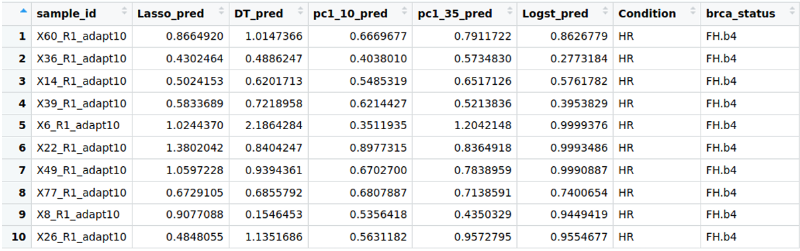


### Lasso-pred
```{r}


#Subset the data to only the selected features
train_df = train_df %>% select(one_of(c(nzc, "y")))
#Build 2nd model using the selected features
mod2 <- lm(y ~ ., data = train_df)
#Get the adjusted r-squared of the 2nd model (shows goodness of fit)
r2 <- summary(mod2)$r.square
r2adj = summary(mod2)$adj.r.squared

#Subset the entire table to only the selected features
test_df = df %>% select(one_of(nzc))
#Use the 2nd model to predict on all samples
pred = predict(
            mod2,
            test_df) %>%
            as.data.frame() %>%
    rownames_to_column(var="sample_id") %>%
    dplyr::rename("pred"=".")
title = paste("OC risk predictions(Lasso)",
              "\nLOOCV error =", err,"\nR2 =",r2, "\nR2adj =", r2adj)

#Make boxplot
p = make_boxplot(pred, ann_df, x = "brca_status", y = "pred", 
                 title=title) +
        theme(axis.text.x = element_text(angle = 90, vjust = 0.5, hjust=1))   #Rotate labels for spacing
print(p)

## To seeing the data in plotting the boxplot behind the scene
box_plot_data <- inner_join(pred, ann_df, by = join_by(sample_id))
```


:::


## Logistic Regression

* Similar to Lasso, trained the model using important (13) features

::: panel-tabset

### Box-plot
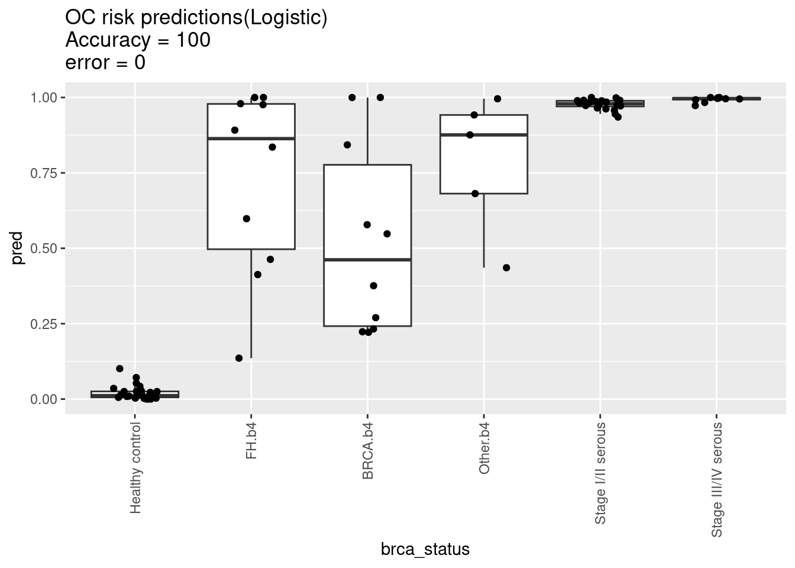

### $\alpha$ = 0.5
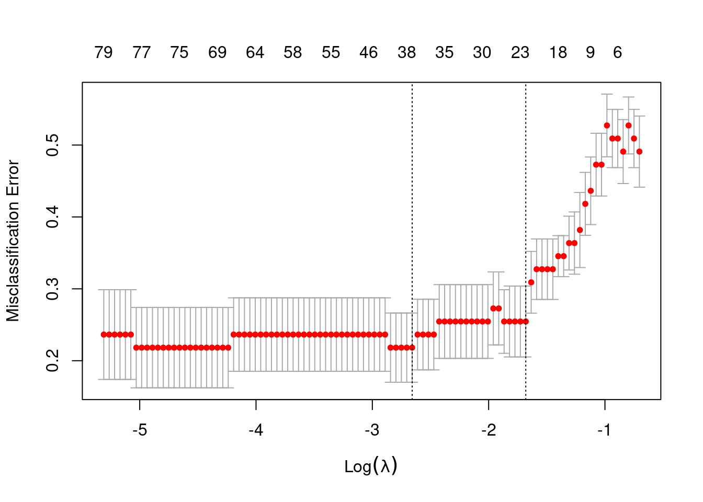

### $\lambda$ (default)
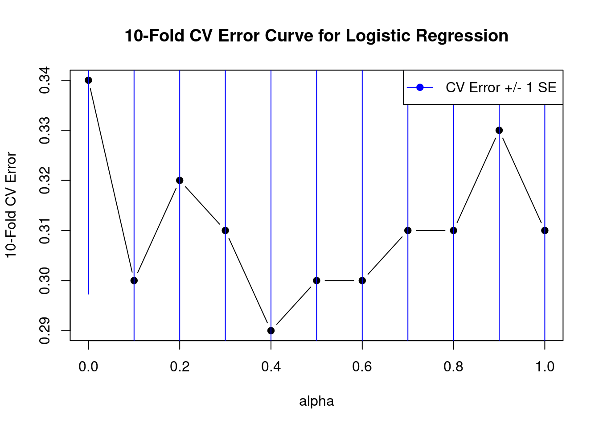


:::


## Decision Tree

- Followed by logistic regression, a `decision tree` was trained using those 13 features

::: panel-tabset


### Box-plot
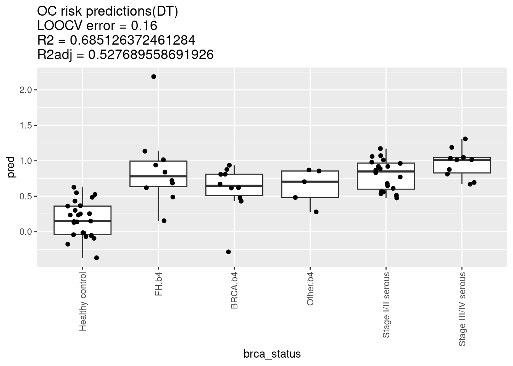

:::


## PCA

- This initial pca model was trained using all the 403 features in the training dataset


::: panel-tabset


### Biplot
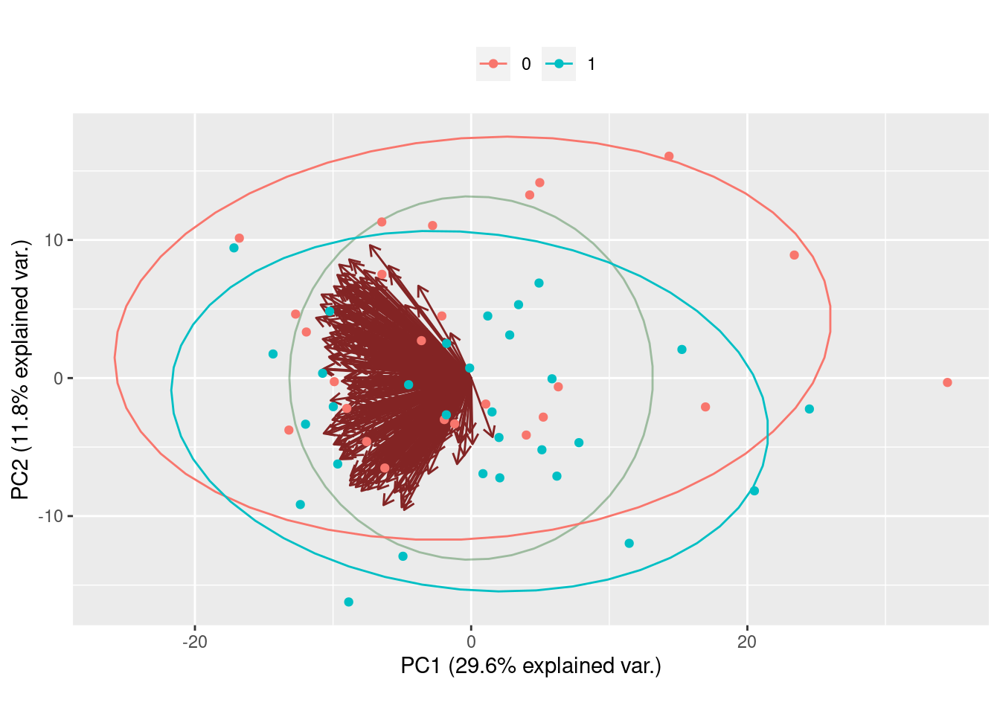


### Scree
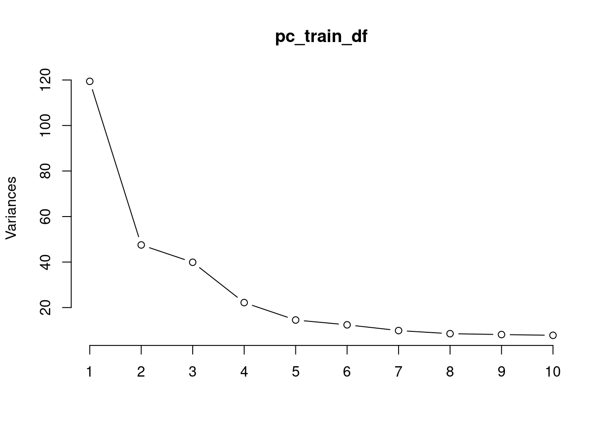


### PC (1-10)
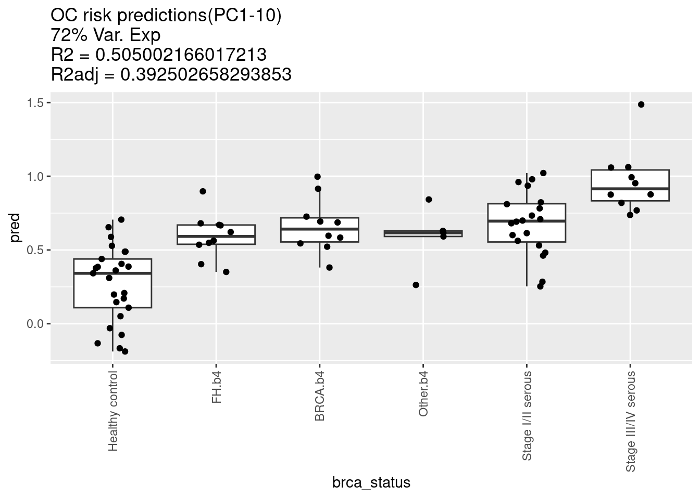


### PC (1-35)
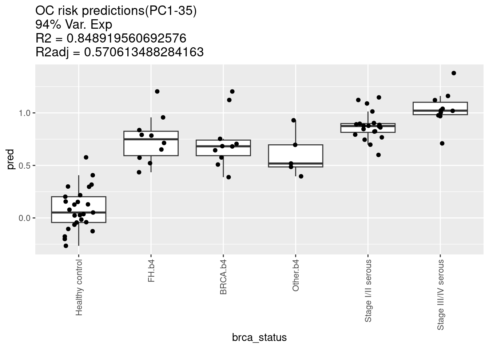
:::


## PCA (contd...)

- Now, let look at the predictions of PCA model trained with Lasso selected (13) variables

::: panel-tabset

### Biplot
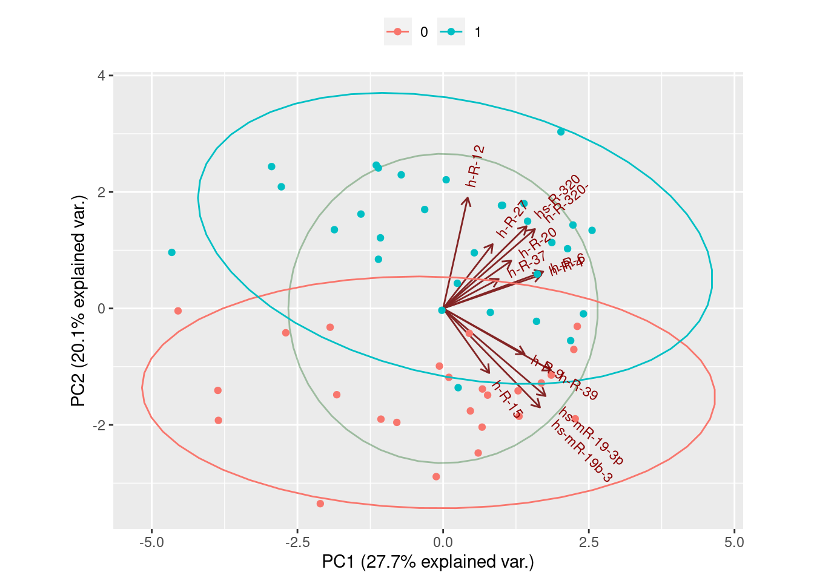


### Scree
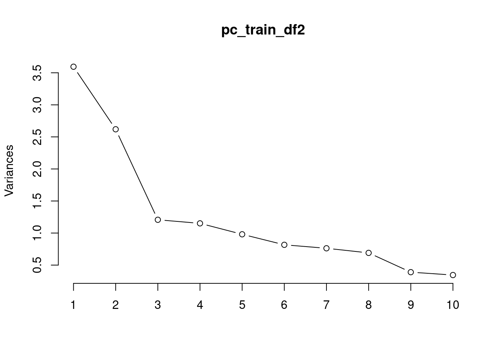

### Box 
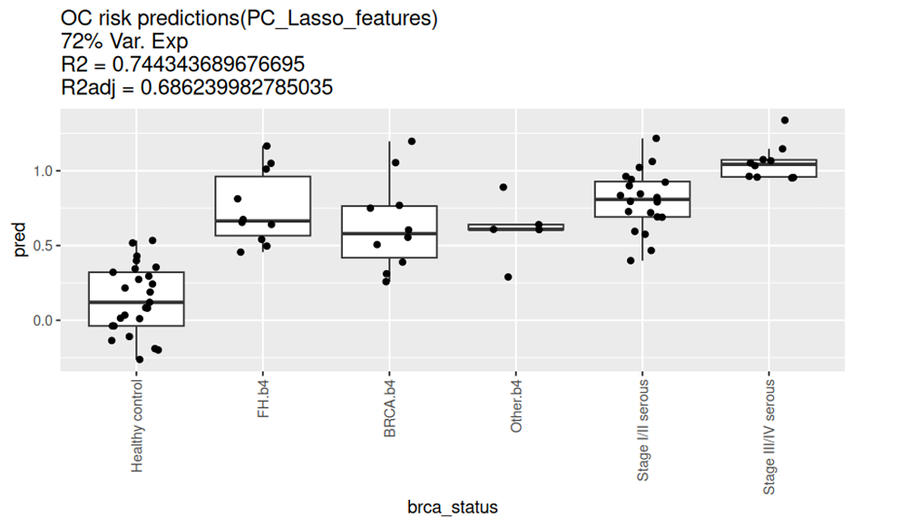
:::


## Predictions

- Overview of the performance of all the models on the test-set

::: panel-tabset

### Line Plot
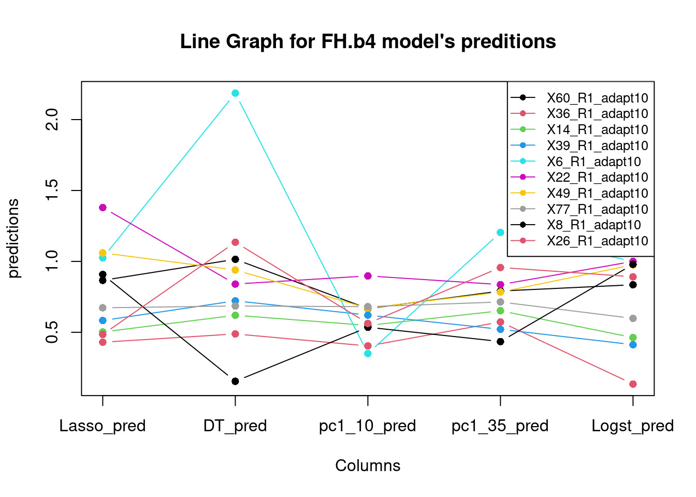

### Line (no legend)
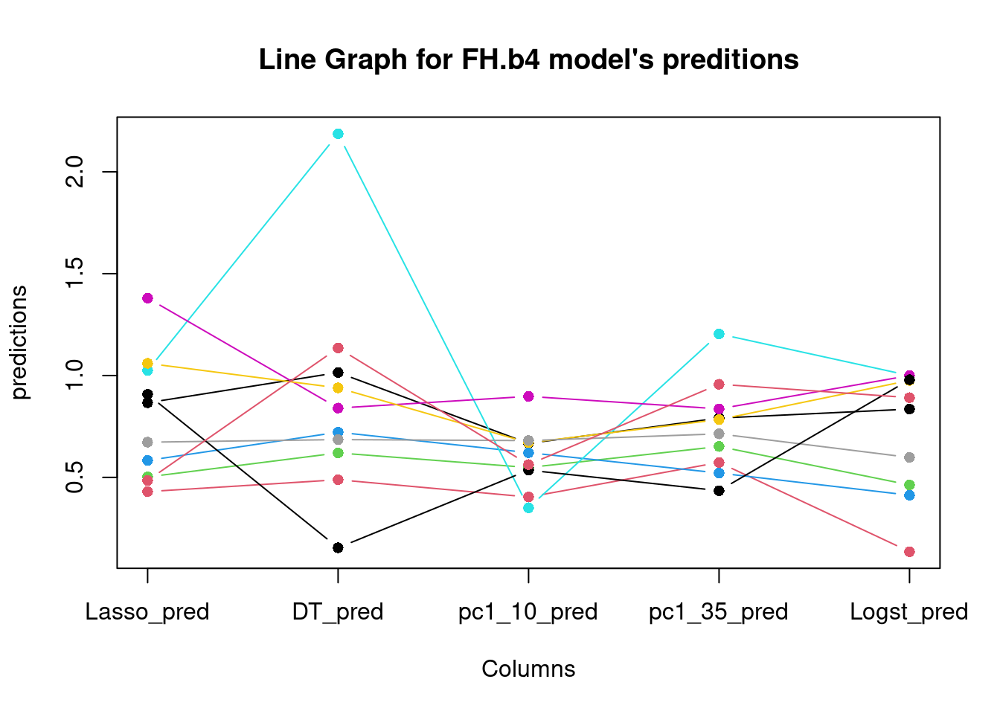

### CV error
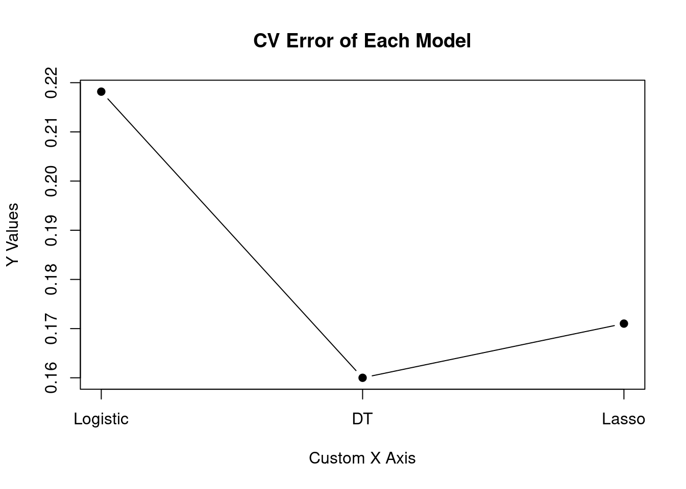

### Table

:::


# Thank You

